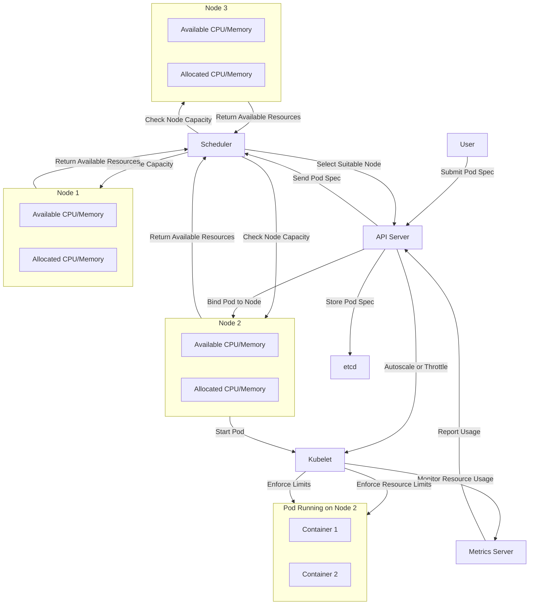

```mermaid
graph TD;
    User[User] -->|Submit Pod Spec| API[API Server]
    API -->|Store Pod Spec| etcd[etcd]
    API -->|Send Pod Spec| Scheduler[Scheduler]
    
    subgraph Node1[Node 1]
        Node1_1[Available CPU/Memory]
        Node1_2[Allocated CPU/Memory]
    end
    
    subgraph Node2[Node 2]
        Node2_1[Available CPU/Memory]
        Node2_2[Allocated CPU/Memory]
    end
    
    subgraph Node3[Node 3]
        Node3_1[Available CPU/Memory]
        Node3_2[Allocated CPU/Memory]
    end

    Scheduler -->|Check Node Capacity| Node1
    Node1 -->|Return Available Resources| Scheduler
    Scheduler -->|Check Node Capacity| Node2
    Node2 -->|Return Available Resources| Scheduler
    Scheduler -->|Check Node Capacity| Node3
    Node3 -->|Return Available Resources| Scheduler
    
    Scheduler -->|Select Suitable Node| API
    API -->|Bind Pod to Node| Node2
    Node2 -->|Start Pod| Kubelet[Kubelet]
    Kubelet -->|Enforce Resource Limits| Pod[Pod]

    subgraph Pod[Pod Running on Node 2]
        Container1[Container 1]
        Container2[Container 2]
    end
    
    Kubelet -->|Monitor Resource Usage| Metrics[Metrics Server]
    Metrics -->|Report Usage| API
    API -->|Autoscale or Throttle| Kubelet
    Kubelet -->|Enforce Limits| Pod

```