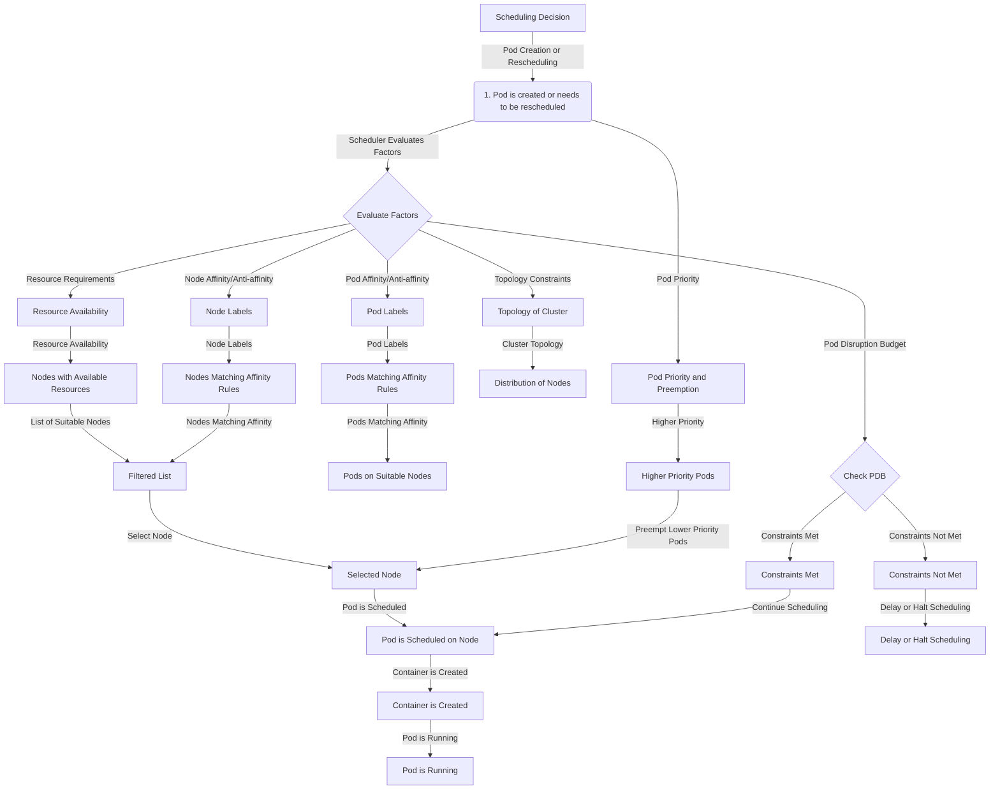

```mermaid
graph TD;
    A[Scheduling Decision] -->|Pod Creation or Rescheduling| B(1. Pod is created or needs to be rescheduled);
    B -->|Scheduler Evaluates Factors| C{Evaluate Factors};
    C -->|Resource Requirements| D[Resource Availability];
    C -->|Node Affinity/Anti-affinity| E[Node Labels];
    C -->|Pod Affinity/Anti-affinity| F[Pod Labels];
    C -->|Topology Constraints| G[Topology of Cluster];
    D -->|Resource Availability| H[Nodes with Available Resources];
    E -->|Node Labels| I[Nodes Matching Affinity Rules];
    F -->|Pod Labels| J[Pods Matching Affinity Rules];
    G -->|Cluster Topology| K[Distribution of Nodes];
    H -->|List of Suitable Nodes| L[Filtered List];
    I -->|Nodes Matching Affinity| L;
    J -->|Pods Matching Affinity| M[Pods on Suitable Nodes];
    L -->|Select Node| N[Selected Node];
    B -->|Pod Priority| O[Pod Priority and Preemption];
    O -->|Higher Priority| P[Higher Priority Pods];
    P -->|Preempt Lower Priority Pods| N;
    N -->|Pod is Scheduled| Q[Pod is Scheduled on Node];
    Q -->|Container is Created| R[Container is Created];
    R -->|Pod is Running| S[Pod is Running];
    C -->|Pod Disruption Budget| T{Check PDB};
    T -->|Constraints Met| U[Constraints Met];
    T -->|Constraints Not Met| V[Constraints Not Met];
    V -->|Delay or Halt Scheduling| X[Delay or Halt Scheduling];
    U -->|Continue Scheduling| Q;

```